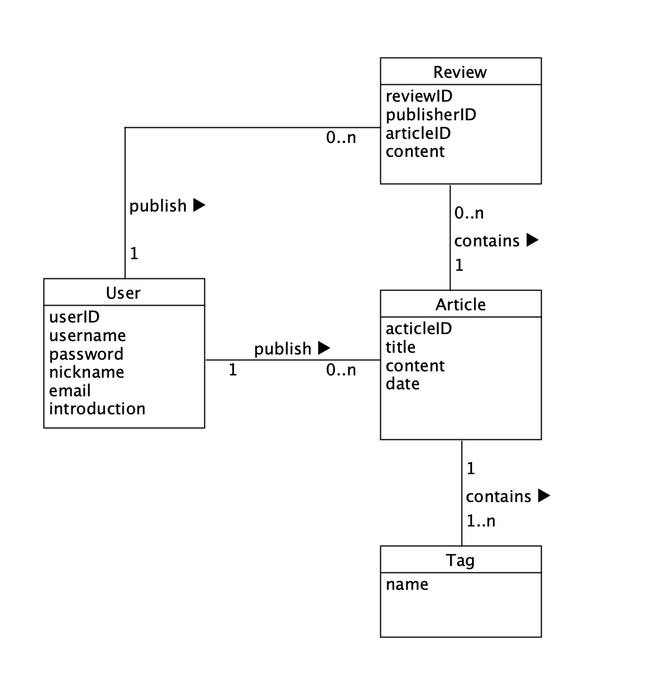
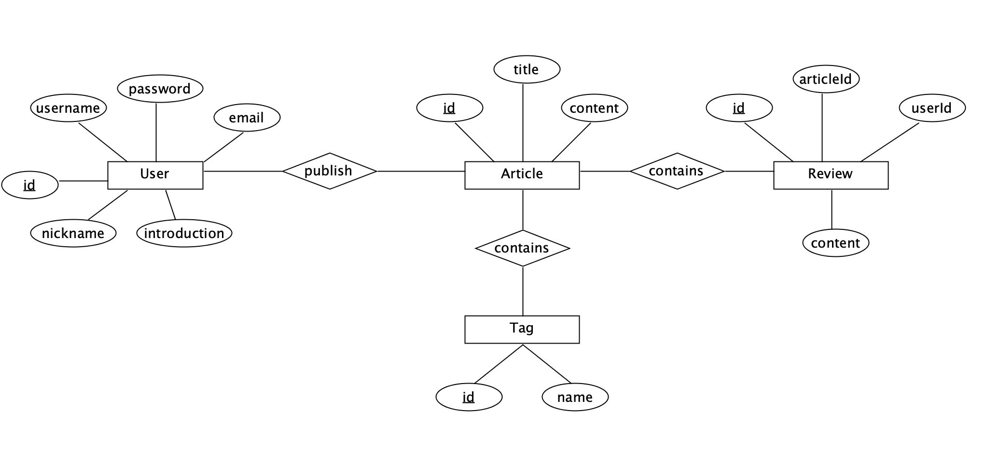

# Miniblog

## 任务目标
选择合适的 API 风格，实现从接口或资源（领域）建模，到 API 设计的过程  
使用 API 工具，编制 API 描述文件，编译生成服务器、客户端原型  
使用 Github 建立一个组织，通过 API 文档，实现 客户端项目 与 RESTful 服务项目同步开发  
使用 API 设计工具提供 Mock 服务，两个团队独立测试 API  
使用 travis 测试相关模块  

---

## 任务实现

###  API 设计
  
API编辑 [Swagger](https://editor.swagger.io/)

**领域建模**


**API**  
[READ API](./go-client/README.md)

---

### 客户端
VUE.js 设计  

---

### 服务端 

安装
```sh
go get https://github.com/Sevice-Computing/Go-REST
cd $GOPATH/src/github.com/Sevice-Computing/Go-REST
go run .
```
---

### 数据库

ER 图


---

### 测试文档

---

### 个人报告

[16340098-鞠擘](./个人报告/16340098-鞠擘.md)

[17343048-黄心弈](./个人报告/17343048-黄心弈.md)

[17343041-赫珊珊](./个人报告/17343041-赫珊珊.md)

[17343077-刘露](./个人报告/17343077-刘露.md)
